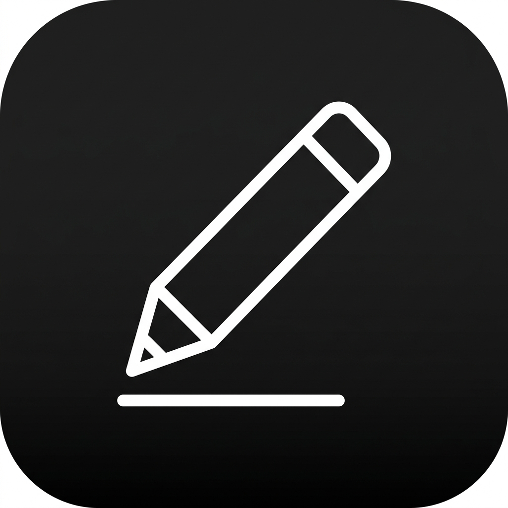
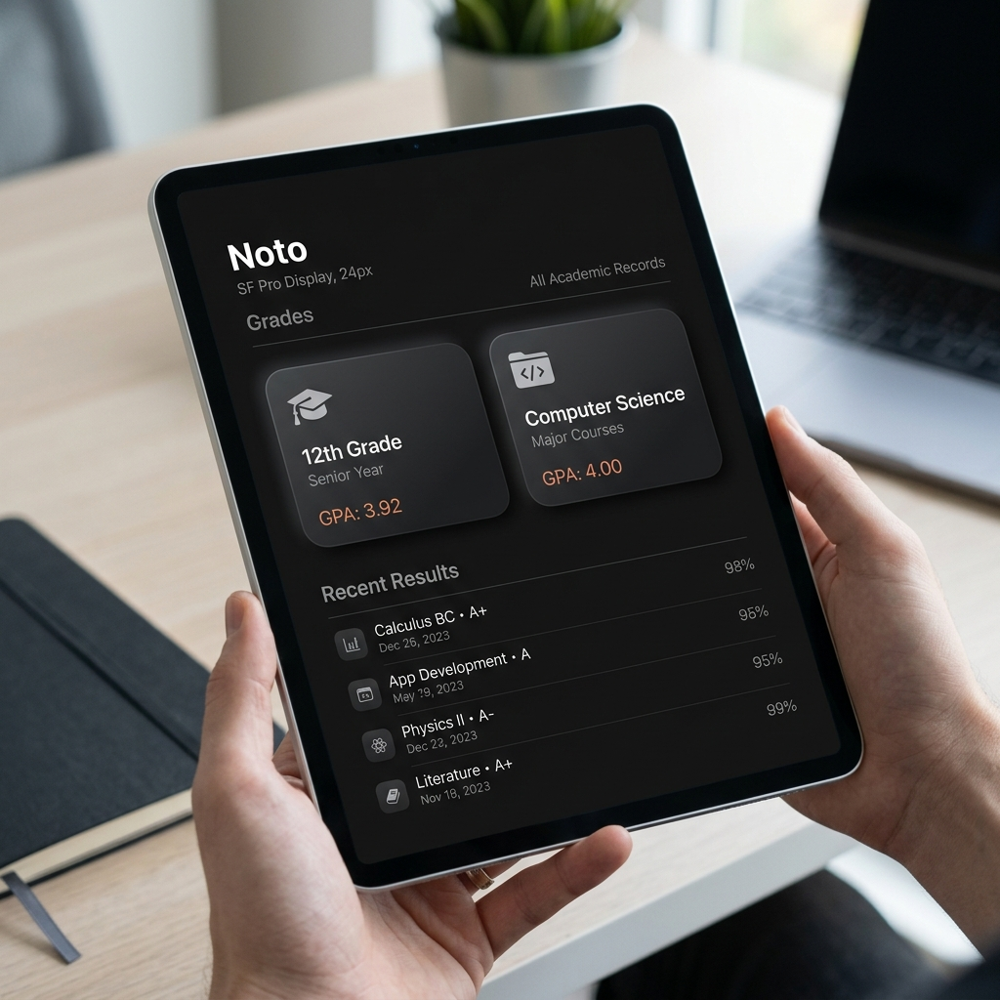

# Noto — The Elite Digital Canvas
### *Smarter Learning. Lighter Future.*

---

**Noto is the catalyst for a fundamental shift in academic productivity.**
Traditional methods are failing the modern student. We provide the singular, high-performance ecosystem required to replace the physical burden of paper with organized, digital intelligence.

[**Explore the Investor Deck**](presentation.html)

 

  
  
<i>The Noto Grades Interface — A Masterclass in Minimalism.</i>

## 🎒 The Crisis of Modern Learning
The academic workflow is currently defined by friction, weight, and waste.

| Metric | Traditional Legacy | The Noto Standard |
| :--- | :--- | :--- |
| **Daily Payload** | 6–8 kg of physical notebooks | **< 500g (one device)** |
| **Sustainability** | 3000+ pages of paper per student/year | **0 pages. Infinite Canvas.** |
| **Retrieval Speed** | Manual page-flipping (Minutes) | **Instant Global Search (Milliseconds)** |
| **Durability** | Vulnerable to physical damage/loss | **Immutable Local & Cloud Persistence** |

## ✨ The Solution: Organizing Intelligence
Noto is engineered as a **Student-First Productivity Suite**. It isn't just a place to draw; it's a place to think.

*   **Pristine Architectural Hierarchy:** Grade → Subject → Notebook → Page. A structure that mirrors the academic cycle.
*   **Zero-Friction Ink Engine:** Built for active styluses with pressure sensitivity and flawless palm rejection. 
*   **Offline-First Autonomy:** Zero reliance on connectivity. Noto lives on your hardware, ensuring your work is always accessible.

## 🏗 Technical Supremacy: Built for Scale
We've traded cloud-dependency for high-performance localized infrastructure.

*   **1GB+ Local Storage Capacity:** Utilizing a custom-tuned IndexedDB engine to handle massive datasets (hundreds of high-quality notebooks) directly on the device.
*   **Capacitor Native Deployment:** Transcending the web-layer to deliver a production-ready Android experience with deep hardware-level integration.
*   **Performance First:** Zero-lag page navigation and instantaneous auto-saving (30s interval background sync).

## 🌍 The Market Opportunity
As global education shifts definitively toward digital-first models, the demand for a non-distracting, professional-grade writing environment is at an all-time high. Noto is positioned to bridge the gap between "simple note apps" and "professional creative tools."

## 🔮 Future Milestones (Roadmap)
- **Q4 2025:** AI-Integrated Global Indexing (Handwriting-to-Text OCR).
- **Q2 2026:** Pro-Grade Cloud Persistence & Cross-Device Ecosystem.
- **Q4 2026:** Custom Hardware Prototype — The Noto Dedicated Note Device.

---

### *"This is not just a notebook. This is the future of organized intelligence."*

 

**Designed & Engineered by sam.k**

